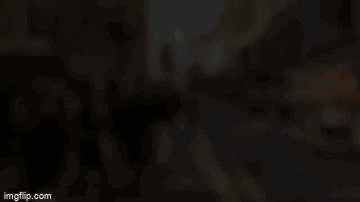

# TheOneWithYolo
Using you only look once technique by employing TF version of DarkNet. This is learning material for me/those who wants to grasp pre-existing technologies and build on top of it for maximum usability of open-source projects.


made a demo of this [video](https://youtu.be/NyLF8nHIquM) from youtube (FYI: I don't claim ownership of this video)

<p align="center">  </p>

## Pre-Trained Weights

For getting pretrained weights, click [here](https://drive.google.com/drive/folders/0B1tW_VtY7onidEwyQ2FtQVplWEU).<br>
You can also download weights from [pjreddie](https://pjreddie.com/darknet/yolo/), but some weight are not compatible with DarkFlow.

## Dependencies

* Cython (as original library was written in C)
* OpenCV
* TensorFlow
* Numpy
* MatplotLib

```bash
pip install cython
pip install tensorflow
pip install numpy
pip install matplotlib
```
As OpenCV is not directly packaged for Windows, So we need use a Unofficial Binary Distribution of OpenCV.<vr>
If you are not using windows, please go ahead and install it like rest.
